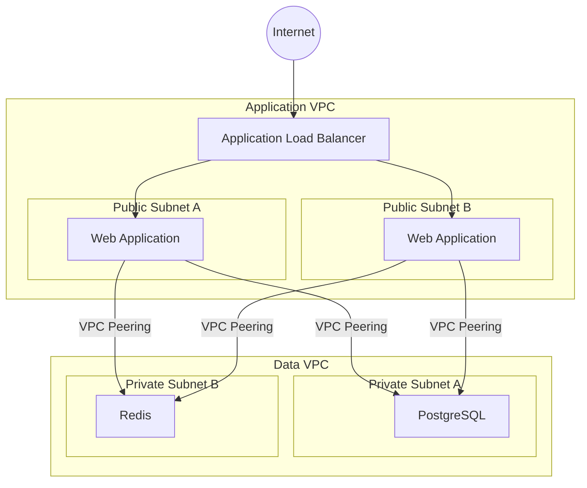
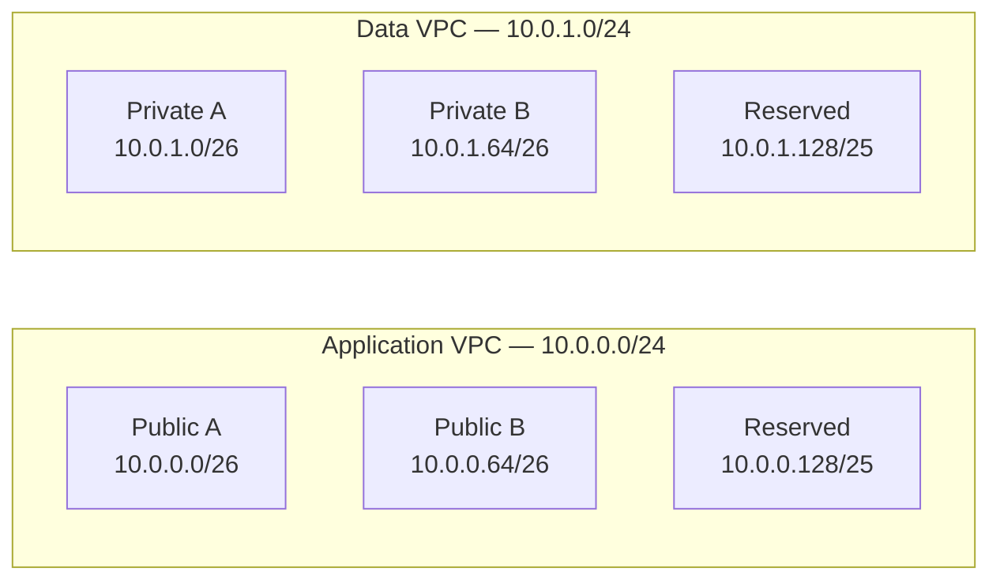
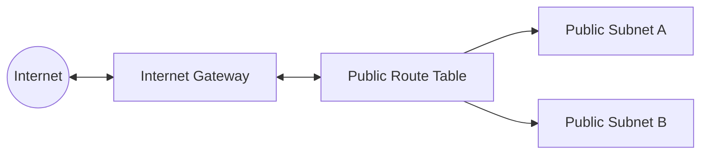

# AWS Multi-VPC Web Architecture with Terraform

## About

This project implements an AWS infrastructure using Terraform for a web application composed of an application layer, PostgreSQL database, and Redis service.

The architecture separates the application and data layers into two distinct VPCs. The web application is exposed to the Internet through an Application Load Balancer (ALB), while PostgreSQL and Redis remain private and are accessible only through controlled communication between the VPCs.

The main goals of the project are to explore AWS networking, infrastructure security, and Infrastructure as Code concepts while building the architecture incrementally.

## Requirements

The infrastructure must satisfy the following requirements:

- Use two distinct VPCs with non-overlapping IPv4 CIDR blocks.
- Deploy the web application across two public subnets.
- Expose the application to the Internet through an Application Load Balancer.
- Ensure the application subnets can support at least 20 instances.
- Place PostgreSQL and Redis in private subnets inside the data VPC.
- Ensure the data subnets can support at least 25 resources.
- Keep PostgreSQL and Redis inaccessible directly from the Internet.
- Run PostgreSQL and Redis in separate execution environments.
- Allow communication from the application to PostgreSQL through VPC Peering.
- Allow communication from the application to Redis through VPC Peering.
- Control traffic between components using Security Groups.
- Configure route tables with only the routes required by the architecture.
- Allow private resources to access the Internet when required for updates.
- Prevent direct SSH access from the Internet to resources that do not require it.
- Use a Jump Host for administrative access.
- Design the network with future expansion in mind.

## Architecture

The infrastructure is divided into two VPCs:

- **Application VPC** — hosts the public-facing web application and the Application Load Balancer.
- **Data VPC** — hosts PostgreSQL and Redis in private subnets.

The two VPCs communicate through **VPC Peering**, allowing the application to reach the data services without exposing them directly to the Internet.



### Traffic Flow

The main request flow is:

```text
Internet
   ↓
Application Load Balancer
   ↓
Web Application
   ↓
VPC Peering
   ↓
PostgreSQL / Redis
```

Only the application layer is directly reachable from the Internet. PostgreSQL and Redis remain private and receive traffic only from authorized application resources.

## Network Design

The architecture uses two non-overlapping IPv4 CIDR blocks, one for each VPC.

| Network         | CIDR          | Purpose                                          |
| --------------- | ------------- | ------------------------------------------------ |
| Application VPC | `10.0.0.0/24` | Application infrastructure                       |
| Data VPC        | `10.0.1.0/24` | PostgreSQL, Redis, and supporting infrastructure |

### Application VPC

The application VPC initially contains two public subnets distributed across different Availability Zones.

| Subnet               | CIDR           | Type   | Usable IPv4 addresses |
| -------------------- | -------------- | ------ | --------------------: |
| Application Public A | `10.0.0.0/26`  | Public |                    59 |
| Application Public B | `10.0.0.64/26` | Public |                    59 |

The remaining address space is reserved for future expansion.

### Data VPC

The data VPC initially contains two private subnets.

| Subnet         | CIDR           | Type    | Usable IPv4 addresses |
| -------------- | -------------- | ------- | --------------------: |
| Data Private A | `10.0.1.0/26`  | Private |                    59 |
| Data Private B | `10.0.1.64/26` | Private |                    59 |

The remaining address space can later be divided into additional subnets for components such as NAT infrastructure or other services.

### CIDR Layout



## Routing and Internet Access

Each subnet is associated with a route table that determines where its traffic can be sent.

### Public Application Subnets

The application subnets are public because their route table contains a default route to an Internet Gateway.

```text
Destination     Target
10.0.0.0/24     local
0.0.0.0/0       Internet Gateway
```

The Internet Gateway provides connectivity between the Application VPC and the Internet. A subnet with a direct route to an Internet Gateway is considered public.



### Private Data Subnets

The data subnets do not have a direct route to an Internet Gateway and are therefore private.

Initially, their route table contains only the local VPC route:

```text
Destination     Target
10.0.1.0/24     local
```

PostgreSQL and Redis therefore cannot directly communicate with the public Internet.

The project, however, requires private resources to access the Internet when necessary for updates.

To support outbound Internet access without making these resources public, the architecture will later introduce a NAT Gateway:

```text
Private Resource
      ↓
Private Route Table
      ↓
NAT Gateway
      ↓
Internet Gateway
      ↓
Internet
```

A NAT Gateway allows resources in private subnets to initiate outbound connections while preventing unsolicited Internet connections from being initiated toward them.
