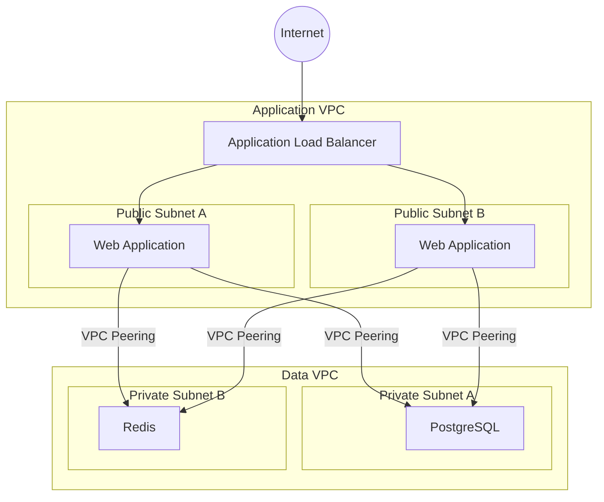
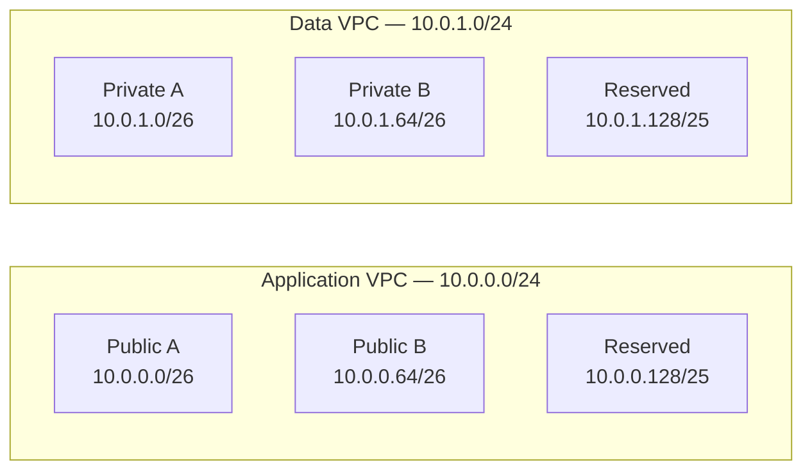
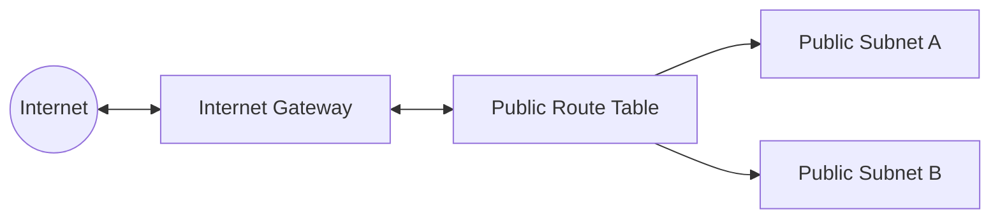
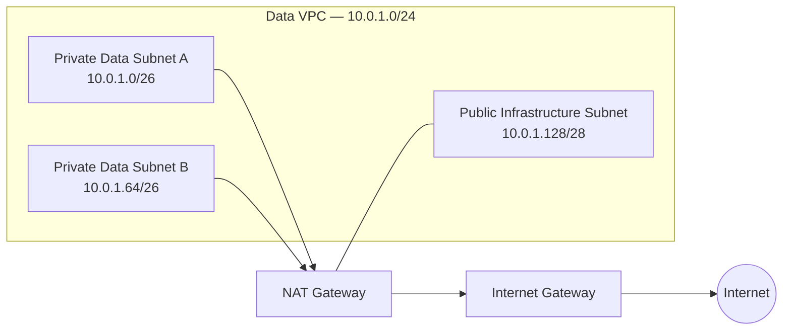
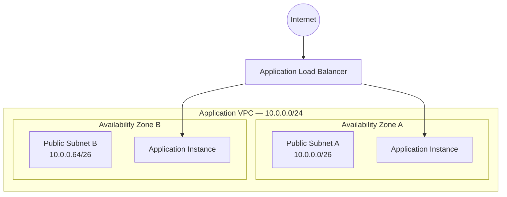
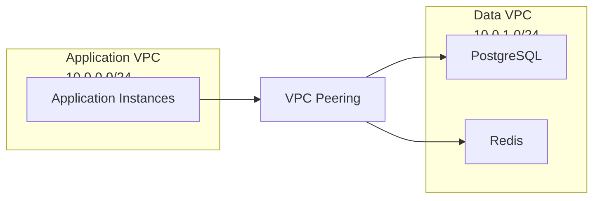
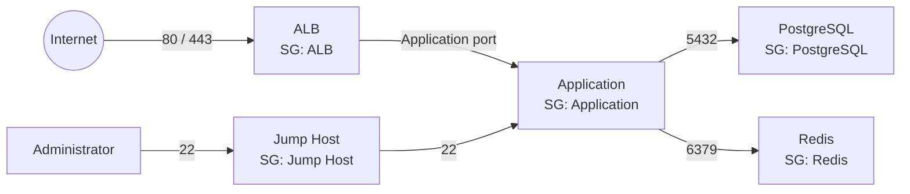
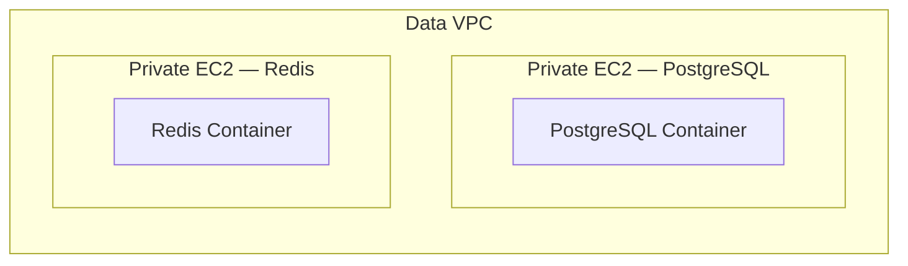
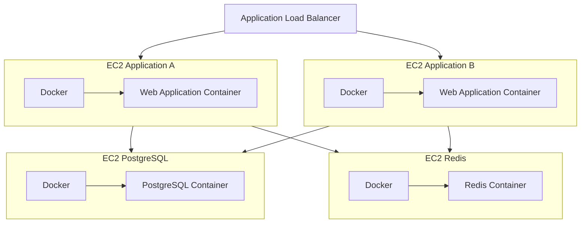

# AWS Multi-VPC Web Architecture with Terraform

## About

This project implements an AWS infrastructure using Terraform for a web application composed of an application layer, PostgreSQL database, and Redis service.

The architecture separates the application and data layers into two distinct VPCs. The web application is exposed to the Internet through an Application Load Balancer (ALB), while PostgreSQL and Redis remain private and are accessible only through controlled communication between the VPCs.

The main goals of the project are to explore AWS networking, infrastructure security, and Infrastructure as Code concepts while building the architecture incrementally.

## Requirements

The infrastructure must satisfy the following requirements:

- Use two distinct VPCs with non-overlapping IPv4 CIDR blocks.
- Deploy the web application across two public subnets.
- Expose the application to the Internet through an Application Load Balancer.
- Ensure the application subnets can support at least 20 instances.
- Place PostgreSQL and Redis in private subnets inside the data VPC.
- Ensure the data subnets can support at least 25 resources.
- Keep PostgreSQL and Redis inaccessible directly from the Internet.
- Run PostgreSQL and Redis in separate execution environments.
- Allow communication from the application to PostgreSQL through VPC Peering.
- Allow communication from the application to Redis through VPC Peering.
- Control traffic between components using Security Groups.
- Configure route tables with only the routes required by the architecture.
- Allow private resources to access the Internet when required for updates.
- Prevent direct SSH access from the Internet to resources that do not require it.
- Use a Jump Host for administrative access.
- Design the network with future expansion in mind.

## Architecture

The infrastructure is divided into two VPCs:

- **Application VPC** — hosts the public-facing web application and the Application Load Balancer.
- **Data VPC** — hosts PostgreSQL and Redis in private subnets.

The two VPCs communicate through **VPC Peering**, allowing the application to reach the data services without exposing them directly to the Internet.



### Traffic Flow

The main request flow is:

```text
Internet
   ↓
Application Load Balancer
   ↓
Web Application
   ↓
VPC Peering
   ↓
PostgreSQL / Redis
```

Only the application layer is directly reachable from the Internet. PostgreSQL and Redis remain private and receive traffic only from authorized application resources.

## Network Design

The architecture uses two non-overlapping IPv4 CIDR blocks, one for each VPC.

| Network         | CIDR          | Purpose                                          |
| --------------- | ------------- | ------------------------------------------------ |
| Application VPC | `10.0.0.0/24` | Application infrastructure                       |
| Data VPC        | `10.0.1.0/24` | PostgreSQL, Redis, and supporting infrastructure |

### Application VPC

The application VPC initially contains two public subnets distributed across different Availability Zones.

| Subnet               | CIDR           | Type   | Usable IPv4 addresses |
| -------------------- | -------------- | ------ | --------------------: |
| Application Public A | `10.0.0.0/26`  | Public |                    59 |
| Application Public B | `10.0.0.64/26` | Public |                    59 |

The remaining address space is reserved for future expansion.

### Data VPC

The data VPC initially contains two private subnets.

| Subnet         | CIDR           | Type    | Usable IPv4 addresses |
| -------------- | -------------- | ------- | --------------------: |
| Data Private A | `10.0.1.0/26`  | Private |                    59 |
| Data Private B | `10.0.1.64/26` | Private |                    59 |

The remaining address space can later be divided into additional subnets for components such as NAT infrastructure or other services.

### CIDR Layout



## Routing and Internet Access

Each subnet is associated with a route table that determines where its traffic can be sent.

### Public Application Subnets

The application subnets are public because their route table contains a default route to an Internet Gateway.

```text
Destination     Target
10.0.0.0/24     local
0.0.0.0/0       Internet Gateway
```

The Internet Gateway provides connectivity between the Application VPC and the Internet. A subnet with a direct route to an Internet Gateway is considered public.



### Private Data Subnets

The data subnets do not have a direct route to an Internet Gateway and are therefore private.

Initially, their route table contains only the local VPC route:

```text
Destination     Target
10.0.1.0/24     local
```

PostgreSQL and Redis therefore cannot directly communicate with the public Internet.

The project, however, requires private resources to access the Internet when necessary for updates.

To support outbound Internet access without making these resources public, the architecture will later introduce a NAT Gateway:

```text
Private Resource
      ↓
Private Route Table
      ↓
NAT Gateway
      ↓
Internet Gateway
      ↓
Internet
```

A NAT Gateway allows resources in private subnets to initiate outbound connections while preventing unsolicited Internet connections from being initiated toward them.

### Data VPC Internet Access

The Data VPC requires a small public infrastructure subnet to provide outbound Internet access for resources inside the private subnets.

The updated Data VPC address allocation is:

| Subnet                  | CIDR            | Type    | Purpose          |
| ----------------------- | --------------- | ------- | ---------------- |
| Data Private A          | `10.0.1.0/26`   | Private | Data services    |
| Data Private B          | `10.0.1.64/26`  | Private | Data services    |
| Infrastructure Public A | `10.0.1.128/28` | Public  | NAT Gateway      |
| Reserved                | Remaining range | —       | Future expansion |

The NAT Gateway is deployed in the public infrastructure subnet and receives an Elastic IP address.



The public infrastructure subnet routes Internet-bound traffic directly to the Internet Gateway:

```text
Destination     Target
10.0.1.0/24     local
0.0.0.0/0       Internet Gateway
```

The private data subnets instead route Internet-bound traffic through the NAT Gateway:

```text
Destination     Target
10.0.1.0/24     local
0.0.0.0/0       NAT Gateway
```

This allows private resources to initiate outbound connections without becoming directly reachable from the Internet.

## Availability Zones

The architecture distributes resources across multiple Availability Zones to reduce dependency on a single physical location.

The Application VPC uses two public subnets, each located in a different Availability Zone:

| Subnet               | CIDR           | Availability Zone |
| -------------------- | -------------- | ----------------- |
| Application Public A | `10.0.0.0/26`  | AZ A              |
| Application Public B | `10.0.0.64/26` | AZ B              |

This is also required by the Application Load Balancer: an ALB must use subnets from at least two different Availability Zones.



The same principle applies to the Data VPC:

| Subnet                  | CIDR            | Availability Zone |
| ----------------------- | --------------- | ----------------- |
| Data Private A          | `10.0.1.0/26`   | AZ A              |
| Data Private B          | `10.0.1.64/26`  | AZ B              |
| Infrastructure Public A | `10.0.1.128/28` | AZ A              |

Using multiple Availability Zones allows the architecture to continue operating even if resources in one zone become unavailable.

## VPC Peering

The Application VPC and Data VPC are connected through a VPC Peering connection.

The peering connection allows resources in the Application VPC to communicate privately with resources in the Data VPC using their private IPv4 addresses.



Creating the peering connection alone is not enough. Each VPC must also contain routes that direct traffic for the other VPC through the peering connection.

### Application VPC Route

```text
Destination     Target
10.0.0.0/24     local
10.0.1.0/24     VPC Peering
0.0.0.0/0       Internet Gateway
```

### Data VPC Private Route

```text
Destination     Target
10.0.1.0/24     local
10.0.0.0/24     VPC Peering
0.0.0.0/0       NAT Gateway
```

The route `10.0.1.0/24 → VPC Peering` allows the application to reach the Data VPC.

The reverse route `10.0.0.0/24 → VPC Peering` allows response traffic to return to the Application VPC.

## Security Groups

Security Groups control which traffic is allowed between the infrastructure components.

The architecture follows the principle of least privilege: each component only accepts traffic required for its function.

### ALB Security Group

The Application Load Balancer accepts web traffic from the Internet.

```text
Inbound
80/tcp    from 0.0.0.0/0
443/tcp   from 0.0.0.0/0
```

### Application Security Group

Application instances accept traffic only from the Application Load Balancer.

```text
Inbound
Application port    from ALB Security Group
```

The exact application port will be defined when the application layer is implemented.

### PostgreSQL Security Group

PostgreSQL accepts connections only from the application instances.

```text
Inbound
5432/tcp    from Application Security Group
```

### Redis Security Group

Redis accepts connections only from the application instances.

```text
Inbound
6379/tcp    from Application Security Group
```

### Jump Host Security Group

The Jump Host is the only resource intended to receive administrative SSH access.

```text
Inbound
22/tcp    from authorized administrator IP addresses
```

Other instances should not expose SSH directly to the Internet.

### Security Flow



This separates two concerns:

- **Route tables** determine whether a network path exists.
- **Security Groups** determine whether traffic through that path is permitted.

## AWS Resources

The infrastructure will be implemented incrementally using the following AWS resources.

### Networking

- 2 VPCs
- Public and private subnets
- Internet Gateways
- Route Tables
- VPC Peering connection
- NAT Gateway
- Elastic IP for the NAT Gateway

### Application Layer

- Application Load Balancer
- Target Group
- EC2 application instances
- Docker and Docker Compose
- Application Security Group

The web application will run inside Docker containers on EC2 instances distributed across the two public application subnets.

### Data Layer

The data services will also run on EC2 instances using Docker.

- EC2 instance for PostgreSQL
- PostgreSQL Docker container
- EC2 instance for Redis
- Redis Docker container
- Docker Compose for service configuration
- Dedicated Security Groups

PostgreSQL and Redis will run on separate EC2 instances, providing independent execution environments as required by the project.



### Administration

- EC2 Jump Host
- SSH access restricted to authorized administrator addresses
- Administrative access to private EC2 instances through the Jump Host

### Compute Model


