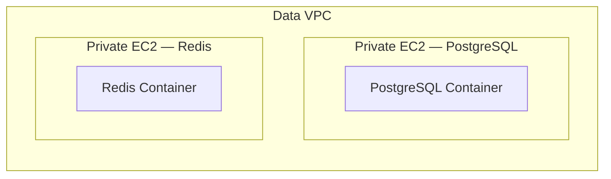
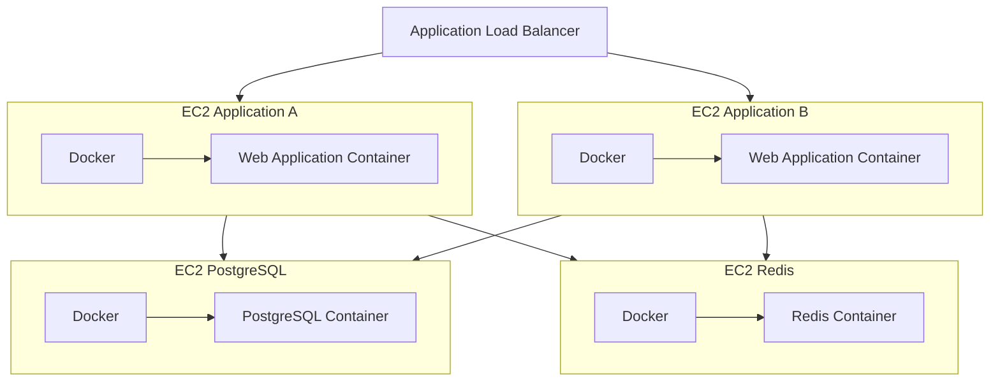

# Infrastructure

[README](../README.md) · [Architecture](architecture.md) · [Networking](networking.md) · [Security](security.md)

## AWS Resources

The Terraform configuration declares the following AWS resources and is ready to deploy.

### Networking

- 2 VPCs
- Public and private subnets
- Internet Gateways
- Route Tables
- VPC Peering connection
- NAT Gateway
- Elastic IP for the NAT Gateway

See [networking](networking.md) for the address allocation, route details, and Availability Zone layout.

### Application Layer

- Application Load Balancer
- Target Group
- EC2 application instances
- Docker and Docker Compose
- Application Security Group

The web application is configured to run inside Docker containers on EC2 instances distributed across the two public application subnets.

### Data Layer

The data services are configured to run on EC2 instances using Docker.

- EC2 instance for PostgreSQL
- PostgreSQL Docker container
- EC2 instance for Redis
- Redis Docker container
- Docker Compose for service configuration
- Dedicated Security Groups

PostgreSQL and Redis run on separate EC2 instances, providing independent execution environments as required by the project.

### Administration

- EC2 Jump Host
- SSH access restricted to authorized administrator addresses
- Administrative access to private EC2 instances through the Jump Host

See [security](security.md) for the administrative and service traffic rules.

### Compute Model

