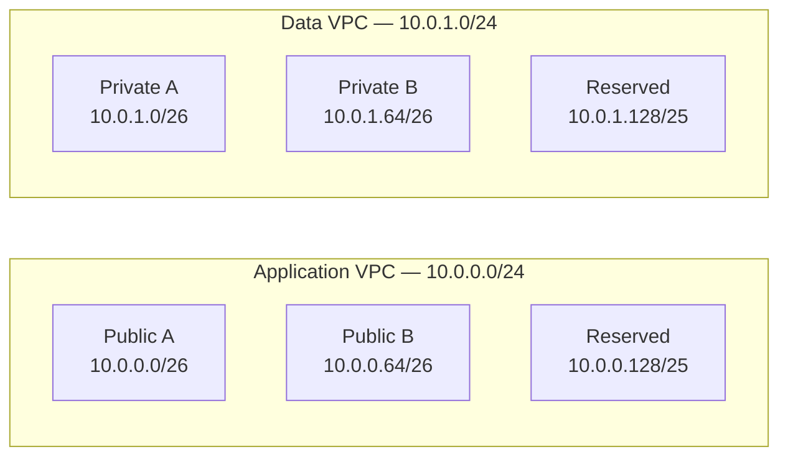
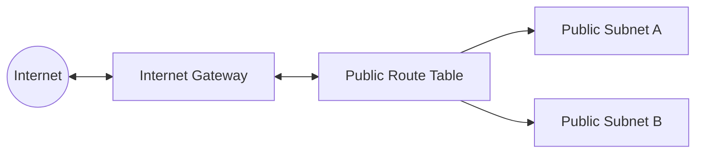
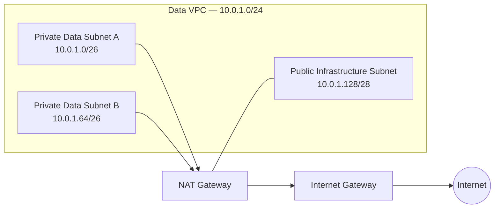
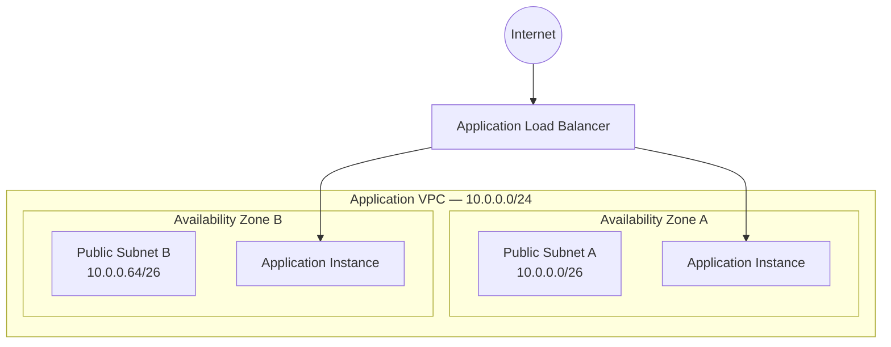
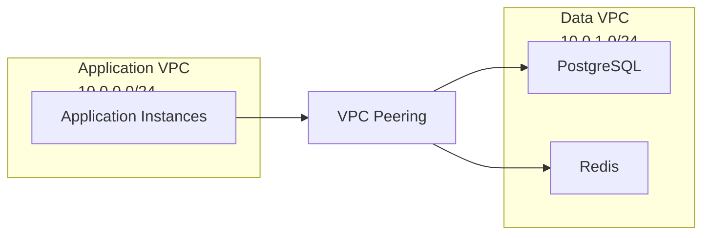

# Networking

[README](../README.md) · [Architecture](architecture.md) · [Security](security.md) · [Infrastructure](infrastructure.md)

## Network Design

The architecture uses two non-overlapping IPv4 CIDR blocks, one for each VPC.

| Network         | CIDR          | Purpose                                          |
| --------------- | ------------- | ------------------------------------------------ |
| Application VPC | `10.0.0.0/24` | Application infrastructure                       |
| Data VPC        | `10.0.1.0/24` | PostgreSQL, Redis, and supporting infrastructure |

### Application VPC

The application VPC initially contains two public subnets distributed across different Availability Zones.

| Subnet               | CIDR           | Type   | Usable IPv4 addresses |
| -------------------- | -------------- | ------ | --------------------: |
| Application Public A | `10.0.0.0/26`  | Public |                    59 |
| Application Public B | `10.0.0.64/26` | Public |                    59 |

The remaining address space is reserved for future expansion.

### Data VPC

The data VPC initially contains two private subnets.

| Subnet         | CIDR           | Type    | Usable IPv4 addresses |
| -------------- | -------------- | ------- | --------------------: |
| Data Private A | `10.0.1.0/26`  | Private |                    59 |
| Data Private B | `10.0.1.64/26` | Private |                    59 |

The remaining address space can later be divided into additional subnets for components such as NAT infrastructure or other services.

### CIDR Layout



## Routing and Internet Access

Each subnet is associated with a route table that determines where its traffic can be sent.

### Public Application Subnets

The application subnets are public because their route table contains a default route to an Internet Gateway.

```text
Destination     Target
10.0.0.0/24     local
0.0.0.0/0       Internet Gateway
```

The Internet Gateway provides connectivity between the Application VPC and the Internet. A subnet with a direct route to an Internet Gateway is considered public.



### Private Data Subnets

The data subnets do not have a direct route to an Internet Gateway and are therefore private.

Initially, their route table contains only the local VPC route:

```text
Destination     Target
10.0.1.0/24     local
```

PostgreSQL and Redis therefore cannot directly communicate with the public Internet.

The project, however, requires private resources to access the Internet when necessary for updates.

To support outbound Internet access without making these resources public, the architecture will later introduce a NAT Gateway:

```text
Private Resource
      ↓
Private Route Table
      ↓
NAT Gateway
      ↓
Internet Gateway
      ↓
Internet
```

A NAT Gateway allows resources in private subnets to initiate outbound connections while preventing unsolicited Internet connections from being initiated toward them.

### Data VPC Internet Access

The Data VPC requires a small public infrastructure subnet to provide outbound Internet access for resources inside the private subnets.

The updated Data VPC address allocation is:

| Subnet                  | CIDR            | Type    | Purpose          |
| ----------------------- | --------------- | ------- | ---------------- |
| Data Private A          | `10.0.1.0/26`   | Private | Data services    |
| Data Private B          | `10.0.1.64/26`  | Private | Data services    |
| Infrastructure Public A | `10.0.1.128/28` | Public  | NAT Gateway      |
| Reserved                | Remaining range | —       | Future expansion |

The NAT Gateway is deployed in the public infrastructure subnet and receives an Elastic IP address.



The public infrastructure subnet routes Internet-bound traffic directly to the Internet Gateway:

```text
Destination     Target
10.0.1.0/24     local
0.0.0.0/0       Internet Gateway
```

The private data subnets instead route Internet-bound traffic through the NAT Gateway:

```text
Destination     Target
10.0.1.0/24     local
0.0.0.0/0       NAT Gateway
```

This allows private resources to initiate outbound connections without becoming directly reachable from the Internet.

## Availability Zones

The architecture distributes resources across multiple Availability Zones to reduce dependency on a single physical location.

The Application VPC uses two public subnets, each located in a different Availability Zone:

| Subnet               | CIDR           | Availability Zone |
| -------------------- | -------------- | ----------------- |
| Application Public A | `10.0.0.0/26`  | AZ A              |
| Application Public B | `10.0.0.64/26` | AZ B              |

This is also required by the Application Load Balancer: an ALB must use subnets from at least two different Availability Zones.



The same principle applies to the Data VPC:

| Subnet                  | CIDR            | Availability Zone |
| ----------------------- | --------------- | ----------------- |
| Data Private A          | `10.0.1.0/26`   | AZ A              |
| Data Private B          | `10.0.1.64/26`  | AZ B              |
| Infrastructure Public A | `10.0.1.128/28` | AZ A              |

Using multiple Availability Zones allows the architecture to continue operating even if resources in one zone become unavailable.

## VPC Peering

The Application VPC and Data VPC are connected through a VPC Peering connection.

The peering connection allows resources in the Application VPC to communicate privately with resources in the Data VPC using their private IPv4 addresses.



Creating the peering connection alone is not enough. Each VPC must also contain routes that direct traffic for the other VPC through the peering connection.

### Application VPC Route

```text
Destination     Target
10.0.0.0/24     local
10.0.1.0/24     VPC Peering
0.0.0.0/0       Internet Gateway
```

### Data VPC Private Route

```text
Destination     Target
10.0.1.0/24     local
10.0.0.0/24     VPC Peering
0.0.0.0/0       NAT Gateway
```

The route `10.0.1.0/24 → VPC Peering` allows the application to reach the Data VPC.

The reverse route `10.0.0.0/24 → VPC Peering` allows response traffic to return to the Application VPC.

