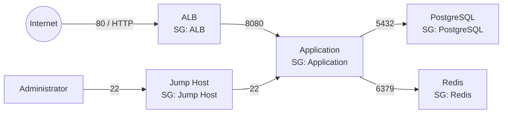

# Security

[README](../README.md) · [Architecture](architecture.md) · [Networking](networking.md) · [Infrastructure](infrastructure.md)

## Security Groups

Security Groups control which traffic is allowed between the infrastructure components.

The architecture follows the principle of least privilege: each component only accepts traffic required for its function.

### ALB Security Group

The Application Load Balancer accepts web traffic from the Internet.

```text
Inbound
80/tcp    from 0.0.0.0/0
```

The ALB listener accepts HTTP on port `80`. HTTPS and an inbound port `443` rule are not configured.

### Application Security Group

Application instances accept traffic only from the Application Load Balancer.

```text
Inbound
8080/tcp    from ALB Security Group
```

The application instances accept traffic on port `8080` only from the ALB Security Group.

### PostgreSQL Security Group

PostgreSQL accepts connections only from the application instances.

```text
Inbound
5432/tcp    from Application Security Group
```

### Redis Security Group

Redis accepts connections only from the application instances.

```text
Inbound
6379/tcp    from Application Security Group
```

### Jump Host Security Group

The Jump Host is the only resource intended to receive administrative SSH access.

```text
Inbound
22/tcp    from authorized administrator IP addresses
```

Other instances should not expose SSH directly to the Internet.

### Security Flow



This separates two concerns:

- **Route tables** determine whether a network path exists.
- **Security Groups** determine whether traffic through that path is permitted.

